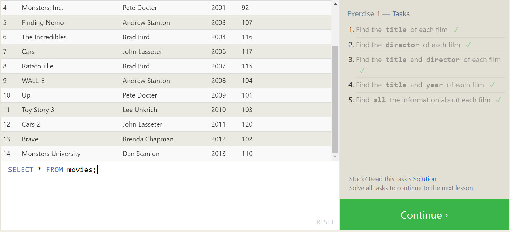
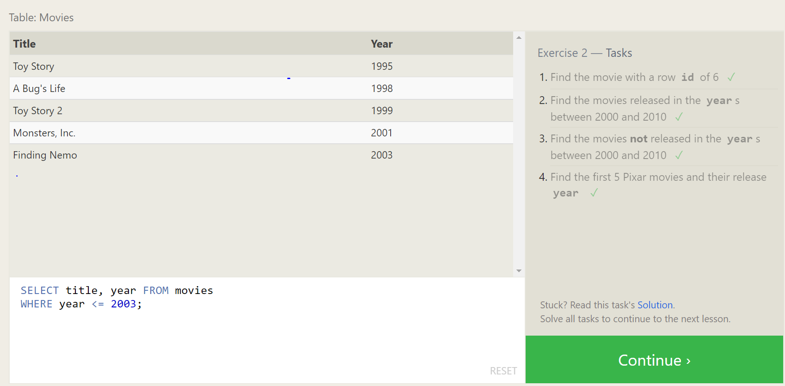
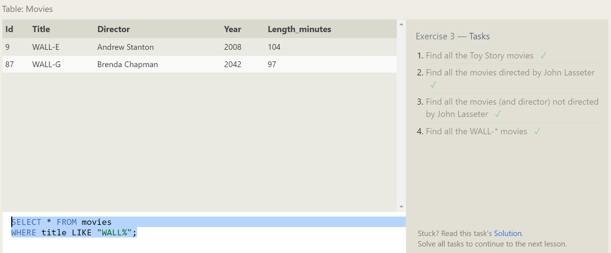
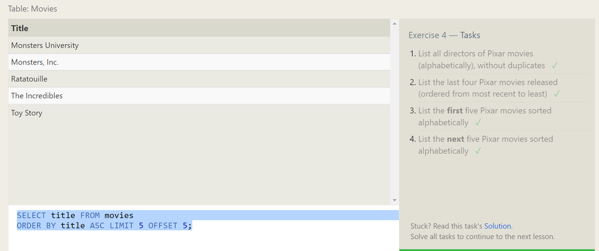
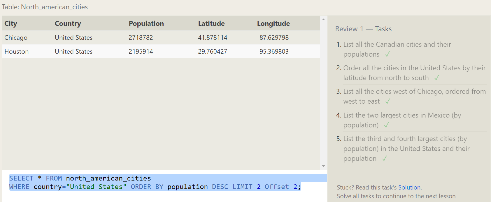
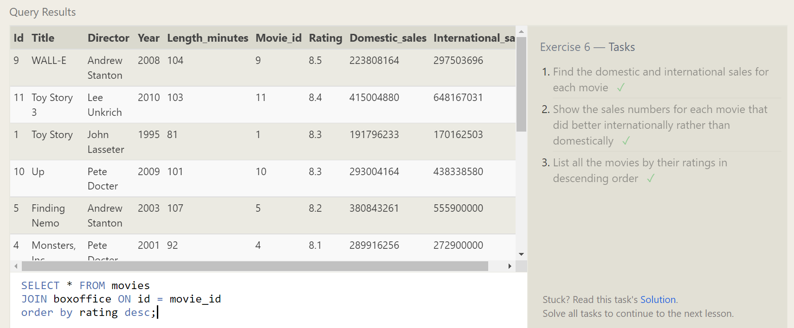
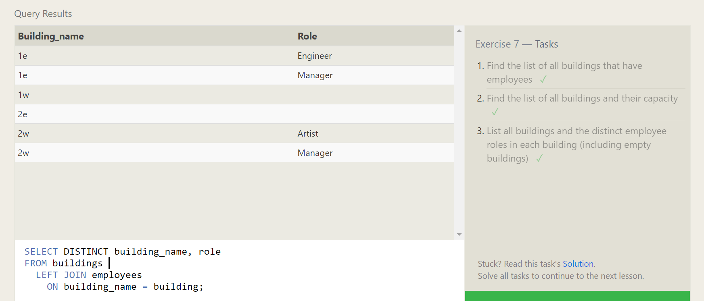
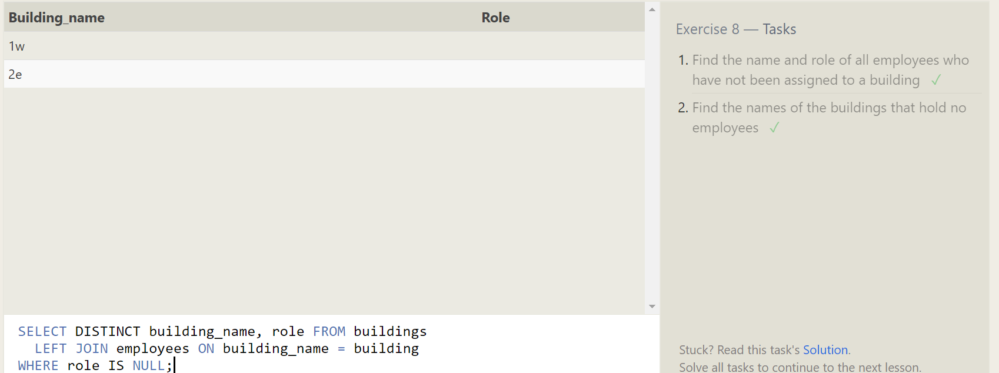

```
-- Exercise 1 — Tasks
-- -----------------------------------------------
SELECT Title FROM movies;
SELECT Director FROM movies;
SELECT Title, Directors FROM movies;
SELECT Title, Year FROM movies;
SELECT * FROM movies;
```


```
-- Exercise 2 — Tasks
-- -----------------------------------------------
-- Find the movie with a row id of 6
SELECT id, title FROM movies 
WHERE id = 6;

-- Find the movies released in the years between 2000 and 2010
SELECT title, year FROM movies
WHERE year BETWEEN 2000 AND 2010;

-- Find the movies not released in the years between 2000 and 2010
SELECT title, year FROM movies
WHERE year NOT BETWEEN 2000 AND 2010;

-- Find the first 5 Pixar movies and their release year
SELECT title, year FROM movies
WHERE year <= 2003;
```



```
-- Exercise 3 — Tasks
-- ---------------------------------------------------

-- Find all the Toy Story movies 
SELECT * FROM movies 
WHERE title LIKE "Toy Story%";

-- Find all the movies directed by John Lasseter
SELECT * FROM movies 
WHERE title LIKE "Toy Story%";

-- Find all the movies (and director) not directed by John Lasseter
SELECT title, director FROM movies 
WHERE director != "John Lasseter";

-- Find all the WALL-* movies
SELECT * FROM movies 
WHERE title LIKE "WALL%";
```


```
-- Exercise 4 — Tasks
-- List all directors of Pixar movies (alphabetically), without duplicates
SELECT DISTINCT director FROM movies
ORDER BY director ASC;

-- List the last four Pixar movies released (ordered from most recent to least)
SELECT title, year FROM movies
ORDER BY year DESC LIMIT 4;

-- List the first five Pixar movies sorted alphabetically
SELECT title FROM movies
ORDER BY title ASC LIMIT 5;

-- List the next five Pixar movies sorted alphabetically
SELECT title FROM movies
ORDER BY title ASC LIMIT 5 OFFSET 5;
```
 


```
-- Review 1 — Tasks
-- List all the Canadian cities and their populations
SELECT city, population FROM north_american_cities
WHERE country = "Canada";

-- Order all the cities in the United States by their latitude from north to south
SELECT * FROM north_american_cities
WHERE country = "United States" order by latitude desc;

-- List all the cities west of Chicago, ordered from west to east
SELECT city, longitude FROM north_american_cities
WHERE longitude < -87.629798 ORDER BY longitude ASC;

-- List the two largest cities in Mexico (by population)
SELECT * FROM north_american_cities
WHERE country="Mexico" ORDER BY population DESC LIMIT 2;

-- List the third and fourth largest cities (by population) in the United States and their population
SELECT * FROM north_american_cities
WHERE country="United States" ORDER BY population DESC LIMIT 2 Offset 2;
```

 


```
-- Exercise 6 — Tasks
-- Find the domestic and international sales for each movie
SELECT title, domestic_sales, international_sales FROM movies
  JOIN boxoffice ON id = movie_id;

-- Show the sales numbers for each movie that did better internationally rather than domestically
SELECT title, domestic_sales, international_sales
FROM movies JOIN boxoffice ON id = movie_id
WHERE international_sales > domestic_sales;

-- List all the movies by their ratings in descending order
SELECT * FROM movies 
JOIN boxoffice ON id = movie_id
order by rating desc;
```

 

```
-- Exercise 7 — Tasks
-- Find the list of all buildings that have employees
SELECT DISTINCT building FROM employees;

-- Find the list of all buildings and their capacity
SELECT * FROM buildings;

-- List all buildings and the distinct employee roles in each building (including empty buildings)
SELECT DISTINCT building_name, role FROM buildings 
  LEFT JOIN employees ON building_name = building;
```


```
-- Exercise 8 — Tasks
-- Find the name and role of all employees who have not been assigned to a building
SELECT name, role FROM employees
WHERE building IS NULL;

-- Find the names of the buildings that hold no employees
SELECT DISTINCT building_name, role FROM buildings 
  LEFT JOIN employees ON building_name = building
WHERE role IS NULL;
```


